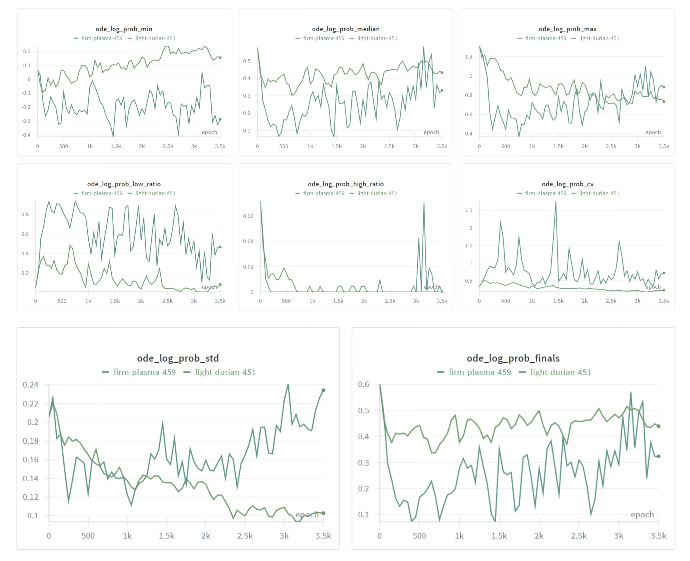
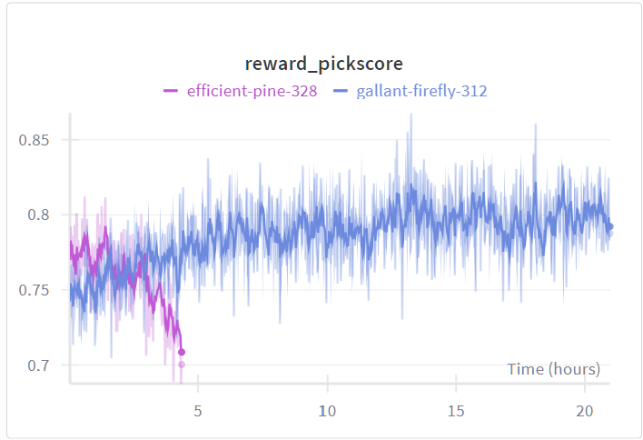

# flow-matching-entropy

## 📖 Introduction

This project extends the Flow-GRPO framework to explore more efficient reward optimization and rigorous diversity analysis for Flow Matching models (e.g., Stable Diffusion 3).

Our work consists of three main contributions:

-   **DRTune Integration:** We implemented the DrTune paradigm within the Flow-GRPO codebase. By backpropagating gradients directly from differentiable reward models (e.g., PickScore) to the generative model, we achieved significantly faster reward convergence.

-   **Diversity Analysis Suite:** We observed that DrTune leads to severe "Reward Hacking" and mode collapse. To quantify this, we integrated Vendi Score, RKE, and proposed a novel Differential Entropy Estimation algorithm for Flow models.

-   **Negative Results on ODE-Prob Optimization:** We investigated whether the estimated ode_log_prob could replace the standard SDE log_prob in RL optimization to improve stability, but found it ineffective due to high variance estimators.

## 🚀 DRTune Implementation

While standard Flow-GRPO treats rewards as black-box scalars, DRTune leverages the differentiability of reward models (e.g., PickScore, CLIPScore) to provide dense gradient signals.

### Implementation

We modified the training loop to support direct gradient backpropagation. When config.use_reward_gradient = True:
1.  The model generates latents via the ODE/SDE pipeline with gradient tracking enabled (requires_grad=True).
2.  Latents are decoded to pixels (keeping the computation graph).
3.  The differentiable reward model calculates the score.
4.  We perform reward.backward() to update the policy model directly.

Note: The logic is based on the paper Deep Reward Supervisions for Tuning Text-to-Image Diffusion Models [arXiv:2405.00760].

### 📊 Results: Efficiency vs. Quality

-   **Pros:** The reward curve ascends much faster than baseline Flow-GRPO.

<p align="center">
  
</p>

-   **Cons (Reward Hacking):** Visual inspection reveals that the model overfits to the reward model's artifacts. We observed a significant drop in diversity and the emergence of unnatural lighting/textures solely to maximize the score.

<p align="center">
  
</p>

## 🧬 Diversity Analysis & Entropy Estimation

To rigorously measure the mode collapse observed in DRTune, we introduced a comprehensive diversity evaluation suite.

**2.1 Differential Entropy via Hutchinson Trace Estimator**

We propose an algorithm to estimate the differential entropy of the Flow Matching model. According to the Instantaneous Change of Variables formula, the change in log-probability density is:

Let $p_t$ be the probability density at time $t$, then:

$$
\frac{d \log p_t(\mathbf{x}_t)}{dt} = -\text{Tr}\left( \nabla_{\mathbf{x}} v_\theta(\mathbf{x}_t, t) \right)
$$

where $\mathbf{x}_t$ follows the flow, and $v_\theta$ is the velocity field.

To avoid the computationally expensive Jacobian trace (O(D^2)), we use the Hutchinson Trace Estimator:

$$
\text{Tr}(J) \approx \mathbb{E}_{\epsilon \sim \mathcal{N}(0, I)} [\epsilon^T J \epsilon]
$$

-   **Validation:** We verified this algorithm on toy distributions (Gaussian, Uniform) and found the estimated results consistent with theoretical values.

-   **Metric:** We found that the standard deviation (std) of ode_log_prob across training steps serves as a strong proxy for diversity.

<p align="center">
  
</p>

**2.2 Vendi Score & RKE**

We integrated other diversity metrics into scripts/diversity_metrics/diversity_evaluator.py:
-   **Vendi Score:** Interpretable diversity metric based on the entropy of the kernel matrix eigenvalues.

-   **RKE (Renyi Kernel Entropy):** Measures the "effective number of modes" in the generated distribution.

## 📉 Negative Results on Optimization

-   **Hypothesis:** Could we use the more theoretically precise ode_log_prob (calculated via ODE trajectory) to replace the standard SDE-based log_prob in the GRPO importance ratio?

$$
r_t(\theta) = \exp\left( \text{ODE-LP}_{\theta} - \text{ODE-LP}_{\text{old}} \right)
$$

where $\text{ODE-LP} = \text{ode\_log\_prob}$.

-   **Experiment:** We modified the loss function to use the ratio of ODE log-probabilities estimated via the Hutchinson method.

-   **Result:** Failed. The reward training became unstable and did not improve.

-   **Analysis:** The Hutchinson estimator relies on a random projection vector \epsilon. The variance introduced by the selection of one \epsilon is inaccurate, making the gradient estimator incredibly noisy and preventing stable RL updates.

<p align="center">
  
</p>

## 💻 Usage

**1. Environment Setup**
Our implementation is based on the [Flow-GRPO](https://github.com/yifan123/flow_grpo) codebase, with most environments aligned.

Clone this repository and install packages by:
```bash
git clone [https://github.com/xinran4real/flow-matching-entropy.git]

conda create -n fm_entropy python=3.10.16
pip install torch==2.6.0 torchvision==0.21.0 --index-url https://download.pytorch.org/whl/cu126
pip install -e .
```
**2. Training with DRTune (Gradient Backprop)**

To train using the DRTune logic (direct reward gradients) on PickScore:
```bash
accelerate launch --config_file scripts/accelerate_configs/multi_gpu.yaml \
  --num_processes=4 \
  scripts/train/train_sd3.py \
  --config config/grpo.py:pickscore_sd3_1batch_size_use_gradient
```
Key Configs: Ensure config.use_reward_gradient = True and config.sample.train_batch_size = 1 (no need to sample multiple images).

**3. Evaluating Diversity & Entropy**

To evaluate a checkpoint or a running model for Vendi Score, RKE, and Entropy:
```bash
# Evaluate diversity metrics along the RL
accelerate launch scripts/train/train_sd3_nsr.py \
  --config config/grpo.py:pickscore_sd3_4gpu_nsr
```
Key Configs: check config.eval_diversity, config.eval_ode_log_prob and config.visualize_steps.
```bash
# Run specific visualization from checkpoints
python visualize_from_checkpoints.py \
  --checkpoint_dir "logs/pickscore/checkpoints" \
  --visualize_all=True
```

**4. Configuration Details (config/grpo.py)**

-   use_reward_gradient: Enables DRTune mode.

-   eval_ode_log_prob: Enables calculation of flow entropy during eval.

-   eval_diversity: Triggers Vendi/RKE calculation.


## 📚 Acknowledgement

This project is built upon the Flow-GRPO codebase. We thank the authors for their open-source contribution.

The DRTune implementation is based on the paper: Deep Reward Supervisions for Tuning Text-to-Image Diffusion Models.
